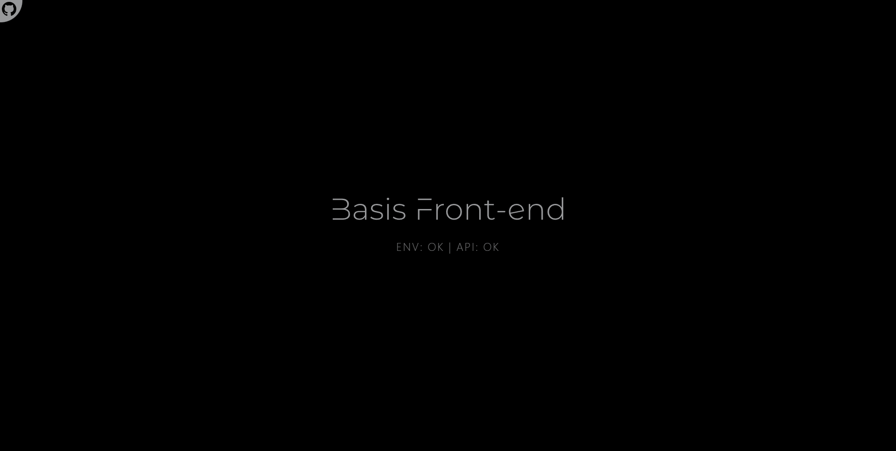
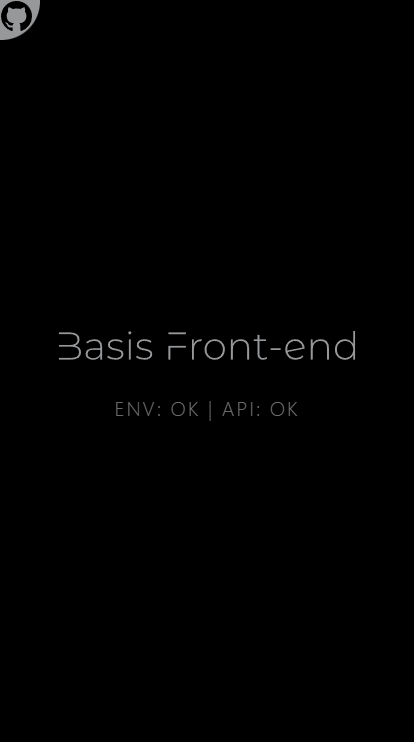

<p align="center">
  <a href="https://basis-frontend.sebastianlacoste.com" target="_blank" rel="noopener noreferrer">
    
  </a>
</p>
<hr/>

> [Basis Front-end](https://basis-frontend.sebastianlacoste.com) is my ...Basis Front-end.

## Features

- **PWA Support**

- **Mobile-Friendly**

## Tech Stack

- **Front-end**

  - **Build**

    - [Vite](https://github.com/vitejs/vite)

  - **HTML/JS**

    - [React](https://github.com/facebook/react)

    - [React Router](https://github.com/remix-run/react-router)

  - **CSS**

    - [Tailwindcss](https://github.com/tailwindlabs/tailwindcss)

    - [Postcss](https://github.com/postcss/postcss)

    - [Autoprefixer](https://github.com/postcss/autoprefixer)

## Run Locally

Clone the repository

- HTTPS

  ```bash
  git clone https://github.com/sebastianlacoste/basis-frontend.git
  ```

- SSH

  ```bash
  git clone git@github.com:sebastianlacoste/basis-frontend.git
  ```

Go to the repository directory

```bash
  cd basis-frontend/
```

Install dev/Dependencies

```bash
  npm i
```

Start the server

```bash
  npm run dev
```

In the browser, go to

```
  http://localhost:3000
```

**All-In-One**

- HTTPS

  ```bash
  git clone https://github.com/sebastianlacoste/basis-frontend.git; cd basis-frontend/; npm i; npm run dev;
  ```

- SSH

  ```bash
  git clone git@github.com:sebastianlacoste/basis-frontend.git; cd basis-frontend/; npm i; npm run dev;
  ```

## Screenshots

- **Desktop**

   

- **Mobile**

  

## License

- [MIT](./LICENSE)